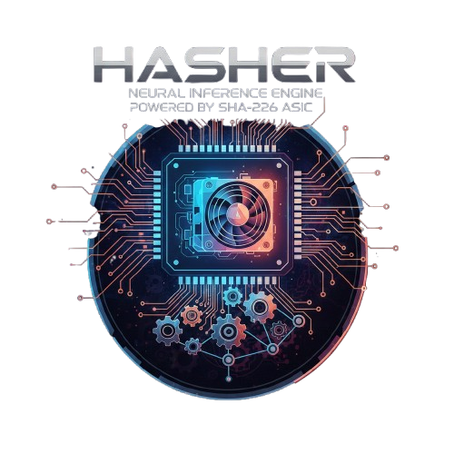

<p align="center">

</p>

# AI-ASIC

**SHA-256 hash neural-network inference on repurposed Bitcoin mining hardware.**

AI-ASIC is a pure-Python, cross-platform (Windows / macOS / Linux) implementation of the
[HASHER](https://github.com/guiperry/HASHER) engine (GPL-3.0), extended with support for
**newer Bitmain ASIC miners** - the Antminer S9 family (BM1387) through the S17 / S19 / S21
generations - with automatic model detection.

It treats a mining ASIC as a deterministic SHA-256 engine: by mining at a "Difficulty 1"
target, the first valid nonce is used as a locality-sensitive hash signature, which drives
a hash-based neural network and a recursive temporal-ensemble inference loop.

> Ported from Go to Python. The engine core uses **only the Python standard library** (no
> third-party runtime dependencies), so it runs on a clean Python 3.8+ install on Windows.

## Why Python / what runs on Windows

The original project had large Linux- and hardware-only subsystems (an eBPF tracer, CUDA
kernels, a MIPS cross-compiled on-device gRPC server, a `/dev/bitmain-asic` kernel driver,
and a spaCy C++ data pipeline). None of those run on Windows in any language. This port
keeps the portable, useful core and reaches real miners the way they are actually driven in
the field - over the **cgminer / bmminer JSON-RPC network API** (TCP port 4028), which works
from Windows with no drivers. See [What was ported](#what-was-ported).

## Install

```bash
# From the repo root (Python 3.8+)
pip install -e .
```

On Windows (PowerShell or cmd) with the official python.org build:

```powershell
py -m pip install -e .
```

No install is required to run it - you can use the launchers or `python -m ai_asic.cli`.

## Quick start

```bash
# List every supported miner model
python -m ai_asic.cli profiles

# Detect the attached miner (uses ASIC_MODEL override or the cgminer API)
python -m ai_asic.cli detect
ASIC_MODEL="Antminer S9" python -m ai_asic.cli detect

# Run recursive inference on text (software backend)
python -m ai_asic.cli infer "optical alignment with AI" --passes 21 --classes 10

# Drive a real S9 (or newer) over the network via cgminer
python -m ai_asic.cli infer "hello" --asic --host 192.168.1.50 --port 4028

# Build a BM1387 (S9) work frame from an 80-byte header
python -m ai_asic.cli encode-work --work-id 42
```

On Windows you can also use the launchers: `run.bat detect` or `.\run.ps1 detect`.

## Graphical interface

A Tkinter GUI ties every capability above (detect, profiles, infer, encode-work)
into one window. Tkinter ships with the standard library, so there is nothing
extra to install on a normal Windows/macOS Python build.

```bash
python -m ai_asic.gui
```

On Windows use `run-gui.bat` or `.\run-gui.ps1`. Long-running detection and
inference run on background threads, so the window stays responsive; switch the
Infer tab's "Use cgminer ASIC backend" checkbox on to target a real miner.

(On a minimal Linux install Tkinter may be a separate package, e.g.
`sudo apt install python3-tk`.)

## Library usage

```python
from ai_asic import HashNetwork, RecursiveEngine, SoftwareHashMethod, detect_asic
from ai_asic.hardware.miner_profiles import detect_profile
from ai_asic.hardware import bm1387

# Detect / describe a miner
print(detect_asic())
profile = detect_profile("Antminer S9")
print(profile.chip, profile.nominal_hashrate)   # BM1387 13500000000000

# Recursive inference
net = HashNetwork(input_size=64, hidden1=128, hidden2=64, output_size=10)
engine = RecursiveEngine(net, passes=21, jitter=0.01, hash_method=SoftwareHashMethod())
result = engine.infer(b"input bytes")
print(result.consensus.prediction, result.consensus.confidence)

# BM1387 (S9) work encoding: midstate + 12-byte tail + CRC16
work = bm1387.new_work_from_header(header_80_bytes, work_id=1)
frame = work.encode()
```

## Supported miners

| Generation | Chip | Models |
|-----------|------|--------|
| USB (original HASHER target) | BM1380 / BM1382 | S1, S2, S3 |
| 28nm control-board | BM1384 / BM1385 | S5, S7 |
| 16nm | BM1387 | **S9, S9i, S9j, S9k, S9 SE, T9+** |
| 7nm | BM1391 / BM1397 / BM1398 | S15, T15, S17, T17, S19, S19 Pro, S19j Pro |
| 5nm | BM1366 / BM1370 | S19 XP, S21 |

Chip counts and hash rates are **nominal factory specs** and vary by batch/firmware.
Details and how to add a model: [`docs/NEWER_MINERS.md`](docs/NEWER_MINERS.md).

## How the S9 differs (BM1387)

- **BM1382 (S2/S3)** - the host pushes a full **80-byte header** to the chip over USB.
- **BM1387 (S9 family / T9+)** - the host pushes a SHA-256 **midstate** of the first 64
  header bytes plus the 12-byte tail (merkle-tail + ntime + nbits); the chip rolls the
  nonce. `ai_asic/hardware/bm1387.py` implements the midstate, 4-way AsicBoost version
  rolling, CRC5 command framing, CRC16 work framing, and nonce-response parsing.

Most S9-class rigs are driven over the cgminer/bmminer API (`ai_asic/cgminer/client.py`),
which is model-agnostic and the Windows-friendly path to real hardware.

## What was ported

| Area | Status | Where |
|------|--------|-------|
| Miner profiles + model detection | ✅ ported | `ai_asic/hardware/miner_profiles.py` |
| BM1387 (S9) work encoder | ✅ ported | `ai_asic/hardware/bm1387.py` |
| Bitcoin header construction | ✅ ported | `ai_asic/hardware/bitcoin_header.py` |
| Device detection | ✅ ported | `ai_asic/hardware/device_detector.py` |
| cgminer/bmminer client | ✅ ported | `ai_asic/cgminer/client.py` |
| Hash neuron / mining neuron | ✅ ported | `ai_asic/hashing/neuron.py` |
| Hash network | ✅ ported | `ai_asic/hashing/network.py` |
| Recursive inference engine | ✅ ported | `ai_asic/hashing/recursive.py` |
| Hashing backends (software + ASIC) | ✅ ported | `ai_asic/hashing/methods.py` |
| CLI | ✅ rewritten | `ai_asic/cli.py` |
| eBPF tracer, CUDA kernels, MIPS on-device server, USB kernel driver, gRPC server, TUI, spaCy pipeline | ❌ not ported | Linux/hardware-only; do not run on Windows. Reach real miners via the cgminer API instead. |

## Performance

SHA-256 itself runs through `hashlib` (OpenSSL C). Large software batches are spread across
worker threads (`hashlib` releases the GIL around the digest call). The highest throughput
comes from offloading the final nonce search to the ASIC over the cgminer API, not from the
host CPU.

## Tests

```bash
pip install pytest
pytest -q
```

## License

GPL-3.0 (inherited from HASHER). See [`LICENSE`](LICENSE) and [`NOTICE.md`](NOTICE.md).
